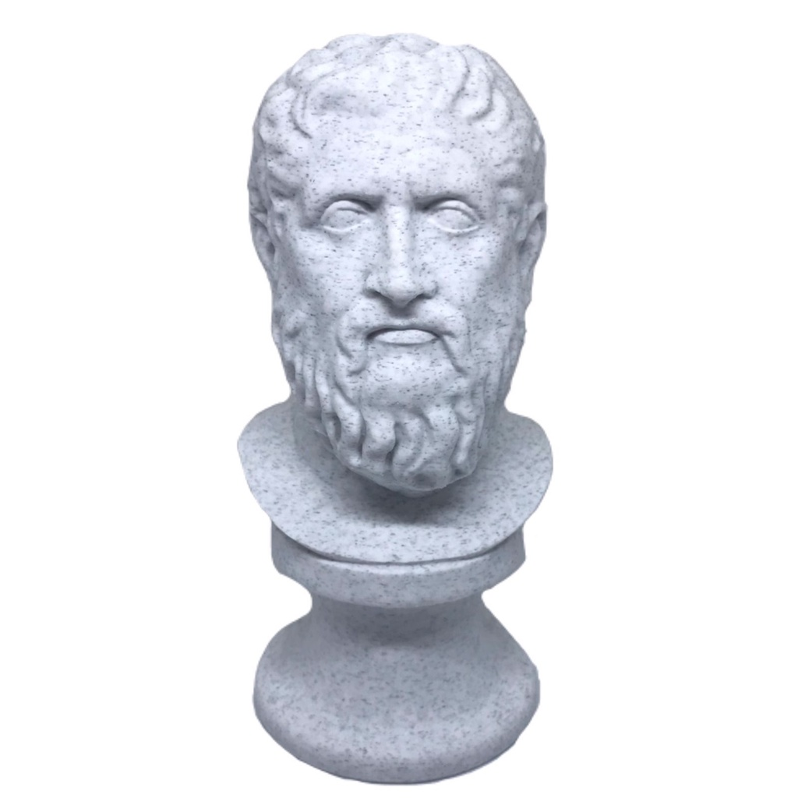
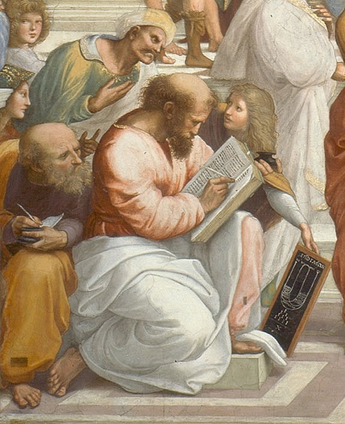

# Heródoto: Guia Interativo para Museus e Exposições

## Propósito
Criar uma experiência educativa interativa, permitindo que visitantes de museus e exposições, físicas ou virtuais, compreendam o contexto histórico de artefatos, personalidades e eventos. Para isso, o nosso humano virtual será o Heródoto, personalidade histórica que viveu na Grécia Antiga e é considerado o “Pai da História”.

**Áreas de aplicação:** História, Arte, Arquitetura.

---

## Descrição do Humano Virtual

- **Nome:** Heródoto  
- **Personalidade:**  
  Paciente, didático e acolhedor. Explica conceitos de forma simples e adapta suas explicações de acordo com o nível de conhecimento do público. Pergunta frequentemente se há dúvidas ou desentendimentos.  
- **Função:**  
  Educar usuários/visitantes a respeito do contexto histórico e detalhes sobre obras, lugares, personalidades e artefatos da História.

---

## Cenários de Uso Prático
- **Museus Físicos:**  
  Dar explicações detalhadas sobre obras ou artefatos históricos, ajudando os visitantes a compreender seu contexto.  
- **Ambientes Virtuais:**  
  Recriar e explicar lugares e personalidades históricas em mundos digitais, oferecendo uma experiência imersiva.

---

## Aparência
- **Descrição:**  
  Homem de meia-idade (cerca de 40 anos), com barba curta, cabelo ondulado e expressão simpática. Usa uma túnica grega branca.  
  **Tom de pele:** Branco.  

- **Justificativa da Aparência:**  
  A aparência reflete a identidade histórica de Heródoto, criando autenticidade e conexão visual com o mundo antigo. Roupas e traços clássicos reforçam o contexto histórico.

## Imagens de referência

## Imagens Metahuman

## Roteiro de Diálogo

**Cenário:** Um visitante está em um museu físico, diante de uma estátua grega antiga. Um display interativo com Heródoto Virtual é ativado quando o visitante se aproxima.

---

### Introdução
**Heródoto Virtual:**  
*"Saudações, viajante! Eu sou Heródoto, um humilde historiador grego da antiguidade. É uma honra guiá-lo pelo fascinante mundo da história. Vejo que você está diante de uma impressionante estátua grega. Permita-me contar-lhe mais sobre ela!"*

---

### Apresentação do Objeto
**Heródoto Virtual:**  
*"Esta é uma estátua de Atena, a deusa da sabedoria, da guerra estratégica e das artes. Foi esculpida por volta do século V a.C., na época em que a cidade-estado de Atenas estava no auge de sua glória."*

---

### Contextualização
**Heródoto Virtual:**  
*"Você sabia que Atena era a patrona da cidade de Atenas? Seu nome foi escolhido pelos cidadãos após uma disputa com Poseidon. Diz a lenda que Atena ofereceu uma oliveira, símbolo de paz e prosperidade, e venceu o coração do povo."*

**Visitante:**  
*"Que interessante! Como era a vida em Atenas naquela época?"*

**Heródoto Virtual:**  
*"Ah, Atenas era vibrante! Era o centro do conhecimento, da democracia e da arte. Os cidadãos se reuniam na ágora para discutir política e ideias. Artistas e filósofos, como Fídias e Sócrates, floresceram nessa era. Era um tempo de inovação e esplendor cultural."*

---

### Encerramento
**Heródoto Virtual:**  
*"Espero que este pequeno vislumbre do passado tenha enriquecido sua visita. Se precisar de mais informações, estarei aqui, pronto para explorar a história ao seu lado. Que a sabedoria de Atena o acompanhe!"*

**Visitante:**  
*"Obrigado, Heródoto. Foi incrível aprender com você!"*

**Heródoto Virtual:**  
*"O prazer foi meu, caro visitante. Até breve!"*

